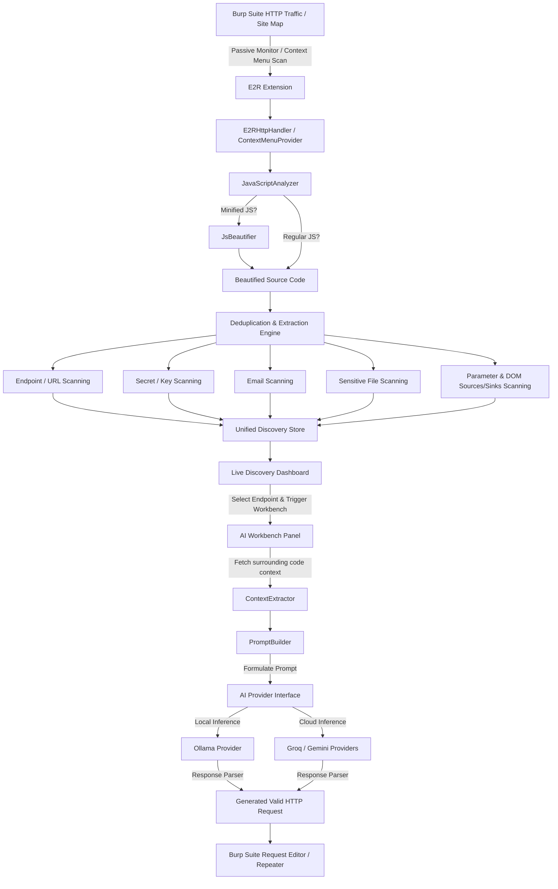
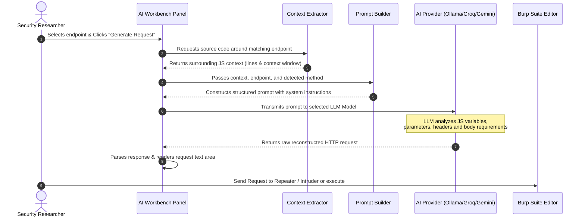
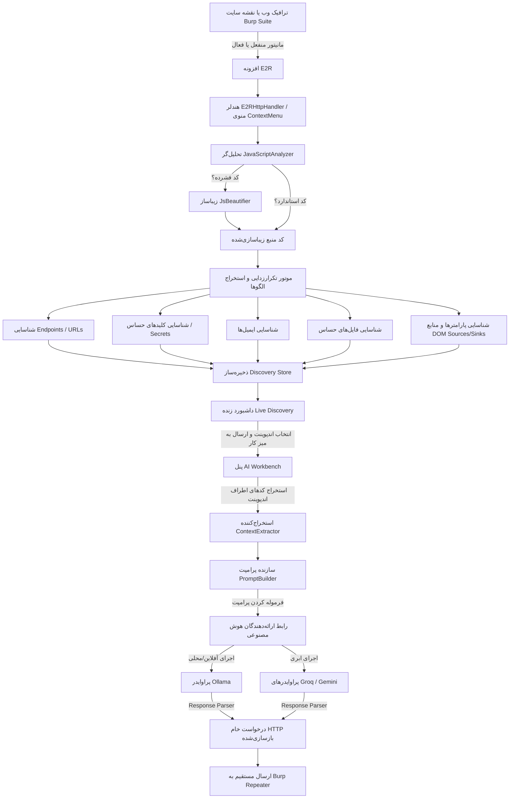
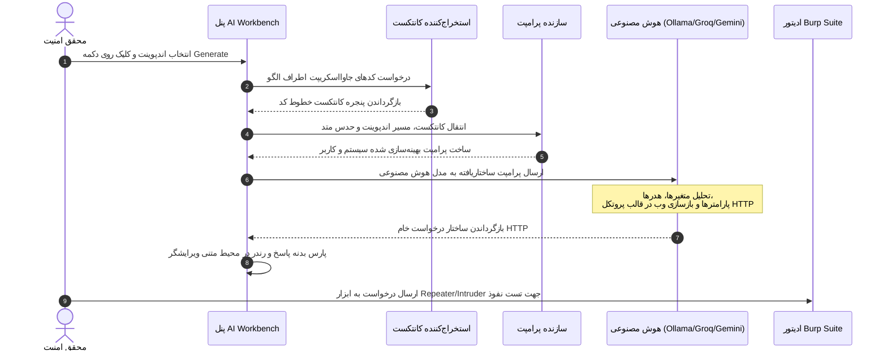

<p align="center">
  <b>Language Selection / انتخاب زبان</b><br>
  <a href="#🇺🇸-english-version">🇺🇸 English</a>
  •
  <a href="#🇮🇷-نسخه-فارسی">🇮🇷 فارسی</a>
</p>

---

# 🇺🇸 English Version

# 🎯 E2R - Endpoint To Request (AI-Powered JS Reconnaissance)

<p align="center">
  
  
  
  
</p>

---

## 🌟 Introduction

**E2R (Endpoint To Request)** is a state-of-the-art **Burp Suite extension** designed to revolutionize client-side JavaScript reconnaissance. Built on the modern **Montoya API**, E2R goes far beyond legacy scanners. It passively monitors, extracts, and categorizes endpoints, URLs, high-entropy secrets, developer emails, parameters, and DOM-based sources/sinks. 

The crown jewel of E2R is its **AI Workbench**. Using local or cloud-based LLMs, E2R parses the surrounding JavaScript code context of a discovered endpoint and **reconstructs a fully valid, raw HTTP request** (complete with realistic parameters, headers, and request bodies) ready to be tested in Burp Repeater or Intruder.

> [!IMPORTANT]
> **CRITICAL SCOPE REQUIREMENT**:
> For E2R to passively process traffic or run active scans, the target domain **MUST be added to Burp Suite's Target Scope** (`Target` -> `Scope`). E2R strictly ignores all traffic, domains, and files outside of the defined target scope to maintain maximum performance and filter out unrelated third-party noise.

---

## 🔍 How E2R Works (Under the Hood)

E2R functions as an intelligent interceptor and scanner that operates seamlessly during your normal browsing workflow or as an active scanner on-demand.

### The Execution Pipeline:

1. **Traffic Interception & Scope Validation**: The extension intercepts incoming HTTP responses. If a resource is within Burp's **Target Scope**, it proceeds. Otherwise, it is instantly ignored.
2. **MIME & Resource Filtration**: E2R validates if the response is a script (e.g., `.js` file, inside HTML `<script>` tags, JSON responses, or MIME-type scripts). It automatically filters out blacklisted extensions (images, CSS, fonts) and directories (like `/_next/`).
3. **On-the-Fly Beautification**: Minified JavaScript files are difficult for regex matchers and LLMs to read. E2R's internal **Beautifier** expands and formats minified code in-memory. This ensures accurate line number tracking and highly readable code contexts for the LLM.
4. **Pattern & Entropy Extraction**: Multi-threaded scanner engines parse the beautified code using tuned, false-positive-resistant regex patterns to identify:
   * **Endpoints**: API routes and relative paths.
   * **URLs**: Absolute external paths.
   * **Secrets**: High-entropy strings (AWS keys, Stripe credentials, slack webhooks, private keys, API keys).
   * **Emails**: Support or developer emails (filtering out dummy or system emails).
   * **Sensitive Files**: References to configuration, backups, environment, or database files (`.env`, `.conf`, `.sql`, etc.).
   * **Parameters**: Query, JSON, and post parameters found in the JS structure.
   * **DOM Sources & Sinks**: DOM properties vulnerable to Client-Side XSS (e.g., `location.hash`, `innerHTML`, `eval`).
5. **Deduplication and Storage**: Findings are passed to a synchronized, thread-safe **Discovery Store** that deduplicates findings on a unique compound key.
6. **AI Prompt Reconstruction**: When a user selects an endpoint in the **AI Workbench**, the extension isolates the surrounding lines of JavaScript source code (the Context Window). It formats a tailored developer prompt containing:
   * The targeted endpoint path and host.
   * A method hint (inferred from surrounding keywords like `POST`, `fetch`, `axios.put`, etc.).
   * The actual code snippet containing parameters.
7. **LLM Generation**: The prompt is processed via your selected provider. The LLM acts as an expert parser, returning a **RAW HTTP request** with realistic payload values.
8. **Security Testing**: The generated request is loaded directly into Burp Suite, letting you send it straight to **Repeater**, **Intruder**, or execution.

---

## 📊 Flowcharts & Architecture

### System Architecture Flowchart



### AI Request Generation Sequence Diagram



---

## ✨ Features

### 1. Unified Live Discovery Dashboard
A clean, tabbed panel that organizes passive scanning findings into categorized tables. It automatically parses JavaScript files to discover and group:

* **Endpoints**: API routes and relative paths extracted from client-side routers or fetch calls.
  
  
* **URLs**: External absolute URLs showing third-party integrations and backend endpoints.
  
  
* **Secrets**: API keys, AWS credentials, auth tokens, Slack webhooks, and private keys.
  
  
* **Emails**: Support, developer, and administrator emails.
  
* **Files**: References to sensitive file extensions (e.g., `.sql`, `.conf`, `.env`, `.bak`).
  
  
* **Parameters**: Query and body parameters mapped from JavaScript objects.
  
  
* **DOM Sources & Sinks**: DOM properties vulnerable to Client-Side XSS, highlighting inputs (Sources) and outputs (Sinks).
  
  

### 2. Live Context Viewer
Select any discovered item to immediately view the file URL, host, exact matching line, and the **surrounding code block** in a syntax-highlighted console. Know exactly how the endpoint or secret is utilized.

### 3. Fully Configurable Filters (Settings Panel)
Fine-tune E2R's detection criteria directly from the **Settings** tab. Add or remove custom patterns dynamically:
* **Extension Blacklist**: Prevent static media or styling files (like `.png`, `.css`, `.woff2`) from cluttering your results.
* **Path Blacklist**: Discard noise from specific paths (e.g., `/_next/`, `/static/js/`, `/node_modules/`).


### 4. Advanced AI Workbench
E2R supports **three major AI providers** with multiple model presets, including custom model inputs and real-time connectivity testers:
1. **Ollama (Local/Offline)**: 100% private, no data leaves your machine. Mapped to speed-optimized coding models like `qwen2.5-coder:7b`.
2. **Groq (Lightning-Fast Cloud)**: Fast, free-tier cloud endpoints using models like `llama-3.3-70b-versatile`.
3. **Google Gemini (Deep Context)**: Perfect for handling extremely large JS context windows using models like `gemini-1.5-flash` or `gemini-2.5-flash`.


---

## 🛠️ Build & Installation

### Prerequisites
* **Java Development Kit (JDK)**: Version 17 or higher.
* **Gradle**: Handled automatically via Gradle Wrapper.
* **Burp Suite Professional or Community**: Edition `2024.12` or newer (essential for Montoya API compatibility).

### Build from Source
Compile and package the extension with a single command:

```bash
# Clone the repository
git clone https://github.com/yourusername/endpoint2Request.git
cd endpoint2Request/E2R

# Grant execution permissions to Gradle wrapper (Linux/macOS)
chmod +x gradlew

# Build the JAR file
./gradlew build
```

The compiled extension will be output directly to the release directory:
* 📂 `release/E2R-1.2.0.jar`

### Loading into Burp Suite
1. Launch **Burp Suite**.
2. Navigate to the **Extensions** tab -> **Installed** sub-tab.
3. Click the **Add** button.
4. Set **Extension type** to `Java`.
5. Click **Select file** and browse to `release/E2R-1.2.0.jar`.
6. Click **Next**. The extension is now successfully installed, and a new tab named **E2R - Endpoint To Request** will appear in the main suite bar!

---

## ⚙️ AI Configuration

Set up your preferred AI provider in the **Settings** tab:

### 1. Local Processing (Ollama)
* **Setup**: Install [Ollama](https://ollama.com) on your computer.
* **Pull Model**: Run `ollama pull qwen2.5-coder:7b` (recommended) or `ollama pull deepseek-coder`.
* **Configuration**: Select **Ollama (Local)** in the provider dropdown. Ensure the URL is `http://localhost:11434`.
* **Testing**: Click **Test Connection** to verify that Ollama is running and the model is loaded.

### 2. Groq Cloud (Free)
* **Setup**: Log in to [Groq Console](https://console.groq.com) and generate a free API Key.
* **Configuration**: Select **Groq (Cloud)**, paste your API Key in the field, and choose a model (e.g., `llama-3.3-70b-versatile`).
* **Saving**: Save settings, then click **Test Connection**.

### 3. Google Gemini
* **Setup**: Obtain an API Key from the Google AI Studio.
* **Configuration**: Select **Gemini (Cloud)**, input your API key, and choose `gemini-1.5-flash`.

---

## ⚠️ Troubleshooting Ollama 404 Error

If you click **Test Connection** in the Settings tab and see `✓ Connected to Ollama (Local)`, but when generating a request in the Workbench you receive:
```text
Error generating request:

Ollama error: 404 Not Found
```
Please verify the following three items to resolve the issue:

1. **Verify Pulled Model Name**: Ollama returns `404 Not Found` if the model specified in E2R Settings does not exist or has not been pulled.
2. **Check Model Spelling**: Run `ollama list` in your terminal to see the exact downloaded names. Ensure the model name in E2R Settings matches the `NAME` column of `ollama list` exactly (e.g. `qwen2.5-coder:7b` instead of just `qwen2.5-coder`).
3. **Pull the Model**: If the model is missing, run `ollama pull <model-name>` (e.g. `ollama pull qwen2.5-coder:7b`) in your terminal.

---

## 🚀 Step-by-Step Security Research Workflow

Maximize your reconnaissance efficiency using this recommended workflow:

### Step 1: Passive Observation
1. **Critical Scope Setup**: Add your target domain to Burp's **Target Scope** (`Target` -> `Scope`).
2. **Proxy Traffic**: Turn on your browser proxy and navigate through the target application.
3. **Passive Scans**: As you click around, E2R automatically intercept and scans any incoming `.js` file or embedded script in real-time.
4. **View Findings**: Go to **E2R** -> **Live Discovery** to watch findings populate.

### Step 2: Target Scope Re-Scanning
1. **Site Map Scan**: Go to Burp's **Target** -> **Site Map**.
2. **Right-Click**: Right-click on the target domain folder (ensure it is in Scope!).
3. **Trigger Scan**: Select **Extensions** -> **E2R: Scan for Endpoints, Secrets & Files**.
4. **Analysis**: E2R will actively query and re-scan every cached JavaScript file in the selected directory.

### Step 3: AI Request Generation
1. Go to the **E2R** tab -> **AI Workbench**.
2. From the list of discovered endpoints, select a target path (e.g. `/api/v1/user/update`).
3. Click the **Generate Request** button.
4. The AI parses the surrounding JavaScript parameters and returns a beautifully structured, raw HTTP request in the text box.

### Step 4: Vulnerability Scanning & Testing
1. Review the generated request in the editor. You can modify parameters, headers, or body fields directly inside E2R.
2. Right-click inside the request editor box.
3. Send the request directly to **Repeater** to execute, or **Intruder** to fuzz!

---

## 🙏 Credits & Inspiration

E2R is built on the shoulders of giants. Special credits go to the authors of:
* **[JSAnalyzer](https://github.com/jenish-sojitra/JSAnalyzer)**: For the baseline regex-based JS parsing structures.
* **LinkFinder**: For pioneer research in JavaScript endpoint discovery.
* **Burp Suite Montoya API**: For providing the ultimate developer experience for Burp extension developers.

---

## 📄 License
This project is licensed under the **MIT License**. Feel free to use, modify, and distribute it in your own commercial or open-source security operations.

---

# 🇮🇷 نسخه فارسی

# 🎯 افزونه E2R - بازسازی درخواست از اندپوینت (شناسایی فایل‌های JS با هوش مصنوعی)

<p align="center">
  
  
  
  
</p>

---

## 🌟 معرفی

**E2R (Endpoint To Request)** یک افزونه پیشرفته و مدرن برای **Burp Suite** است که جهت متحول کردن فرآیند شناسایی و اکتشاف فایل‌های جاوااسکریپت (Client-Side JS) طراحی شده است. E2R با بهره‌گیری از نسخه جدید **Montoya API**، فراتر از یک اسکنر ساده عمل کرده و به صورت غیرفعال (Passive) ترافیک را مانیتور کرده و اقدام به استخراج و دسته‌بندی اندپوینت‌ها، آدرس‌های URL، اسرار با آنتروپی بالا (Secrets)، ایمیل‌های توسعه‌دهندگان، پارامترها و منابع/سینک‌های آسیب‌پذیری DOM XSS می‌کند.

ویژگی منحصر‌به‌فرد E2R بخش **AI Workbench** (میز کار هوش مصنوعی) آن است. با استفاده از مدل‌های زبانی محلی (Offline) یا ابری (Cloud)، این افزونه کانتکست کدهای جاوااسکریپت اطراف یک اندپوینت کشف‌شده را تحلیل کرده و **یک درخواست خام HTTP کاملاً معتبر و واقعی** (همراه با هدرها، پارامترها و بدنه فرضی متناسب با سناریو) بازسازی می‌کند که مستقیماً در ابزار Repeater یا Intruder قابل تست است.

> [!IMPORTANT]
> **شرط الزامی تنظیم Target Scope**:
> برای اینکه E2R بتواند ترافیک ورودی را تحلیل کند یا اسکن‌های فعال انجام دهد، دامنه هدف **باید حتماً در بخش Target Scope در Burp Suite اضافه شده باشد** (`Target` -> `Scope`). E2R برای حفظ حداکثری پرفورمنس و جلوگیری از انباشت داده‌های نامربوط، تمامی ترافیک‌ها و فایل‌های خارج از اسکوپ فعال را به طور کامل نادیده می‌گیرد.

---

## 🔍 نحوه کارکرد فنی (Under the Hood)

افزونه E2R به صورت یک شنودکننده هوشمند و اسکنر هم‌زمان در جریان وب‌گردی روزمره شما یا به صورت اسکن درخواستی (بر اساس منوی راست‌کلیک) کار می‌کند.

### مراحل لوله‌کشی پردازش داده‌ها:

1. **شنود ترافیک و اعتبارسنجی اسکوپ**: افزونه پاسخ‌های HTTP دریافتی را فیلتر می‌کند؛ در صورتی که منبع در محدوده **Target Scope** برپ‌سویت باشد پردازش آغاز می‌شود، در غیر این صورت فورا نادیده گرفته می‌شود.
2. **فیلتر MIME و نوع فایل**: بررسی می‌شود که آیا پاسخ حاوی کدهای جاوااسکریپت (مانند فایل‌های `.js`، تگ‌های `<script>` درون HTML، پاسخ‌های JSON یا سایر انواع ترافیک اسکریپتی) است یا خیر. فرمت‌های استاتیک بلک‌لیست (مانند تصاویر، فونت‌ها و CSS) و مسیرهای نویزدار (مانند `/_next/`) نادیده گرفته می‌شوند.
3. **زیباسازی خودکار کدها (Beautify)**: کدهای فشرده‌شده و Minified برای موتورهای Regex و همچنین مدل‌های زبانی ناخوانا هستند. E2R به صورت خودکار و در لحظه کدهای فشرده را درون حافظه به کدهای خوانا بازسازی (Beautify) می‌کند. این کار به شماره‌گذاری صحیح خطوط کدهای آسیب‌پذیر و ایجاد بهترین کانتکست برای هوش مصنوعی کمک شایانی می‌کند.
4. **استخراج الگوها و آنتروپی**: موتور چندنخی اسکن با استفاده از پترن‌های کاملاً بهینه‌سازی شده و ضد فالس‌پازیتیو (False Positive)، موارد زیر را استخراج می‌کند:
   * **Endpoints**: مسیرهای API و آدرس‌های نسبی.
   * **URLs**: آدرس‌های مطلق به دامنه‌ها یا سرویس‌های خارجی.
   * **Secrets**: رشته‌های حساس با آنتروپی بالا (کلیدهای AWS، Stripe، وب‌هوک‌های Slack، کلیدهای خصوصی و غیره).
   * **Emails**: ایمیل‌های شخصی یا پشتیبانی توسعه‌دهندگان.
   * **Sensitive Files**: ارجاع به فایل‌های حساس پیکربندی یا دیتابیس (`.env`، `.conf`، `.sql` و غیره).
   * **Parameters**: پارامترهای فرمت‌های Query یا بدنه اسکریپت‌ها.
   * **DOM Sources & Sinks**: ورودی‌ها و خروجی‌های خطرناک آسیب‌پذیری DOM XSS (نظیر `location.hash` یا `innerHTML`).
5. **زدودن تکرارها و ذخیره‌سازی**: یافته‌ها پس از عبور از فیلتر تکرارزدایی در یک پایگاه داده همگام و ایمن به نام **Discovery Store** ذخیره می‌شوند.
6. **بازسازی کانتکست و پرامپت**: هنگامی که کاربر یک اندپوینت را در پنل **AI Workbench** انتخاب می‌کند، افزونه چند خط قبل و بعد از آن اندپوینت در کد منبع را به عنوان پنجره کانتکست جدا می‌کند و آن را درون پرامپتی دقیق شامل اطلاعات زیر به هوش مصنوعی می‌فرستد:
   * مسیر اندپوینت و هاست هدف.
   * حدس متد درخواست (مانند `POST` یا `GET` که از عبارات کلیدی مجاور نظیر `fetch` یا `axios.put` استخراج شده است).
   * بدنه کد شامل کانتکست پارامترها.
7. **پردازش هوش مصنوعی**: مدل زبانی با دریافت کانتکست، کدها را تحلیل و یک **درخواست خام HTTP** همراه با مقادیر فرضی به صورت استاندارد Burp Suite تولید می‌کند.
8. **اجرای تست نفوذ**: این درخواست درون ادیتور برپ سویت لود شده و آماده ارسال به **Repeater** یا **Intruder** جهت انجام تست‌های نفوذ خواهد بود.

---

## 📊 نمودارهای معماری پروژه

### فلوچارت معماری سیستم



### نمودار توالی بازسازی درخواست هوش مصنوعی



---

## ✨ قابلیت‌ها و ویژگی‌ها

### ۱. داشبورد یکپارچه کشفیات (Live Discovery Dashboard)
یک پنل تمیز و تب‌بندی شده برای دسترسی لحظه‌ای به موارد استخراج شده از فایل‌های اسکریپت:
* **Endpoints**: استخراج تمیز تمام مسیرهای API به همراه تصاویر پیش‌نمایش.
  
  
* **URLs**: استخراج آدرس‌های مطلق به دامنه‌ها یا منابع خارجی.
  
  
* **Secrets**: شناسایی و مانیتور انواع رشته‌های حساس نظیر کلیدهای سرویس‌های کلاود.
  
  
* **Emails**: لیست ایمیل‌های مرتبط به طراحان و مدیران سیستم.
  
* **Files**: شناسایی هرگونه ارجاع به فایل‌های حساس پشتیبان یا پایگاه‌داده.
  
  
* **Parameters**: لیست پارامترهای کشف شده از درخواست‌ها و آبجکت‌های سمت کلاینت.
  
  
* **DOM Sources & Sinks**: بررسی و استخراج ورودی و خروجی‌های خطرناک آسیب‌پذیری DOM XSS جهت یافتن آسیب‌پذیری‌های کلاینت‌ساید.
  
  

### ۲. نمایشگر زنده کانتکست کد (Live Context Viewer)
با کلیک روی هر آیتم، آدرس کامل اسکریپت، نام هاست، خط دقیق کشف و همچنین چند خط قبل و بعد از آن کد منبع برای شما در قالب یک کنسول تیره و خوانا رندر خواهد شد.

### ۳. فیلترهای پیشرفته بلک‌لیست (Settings Panel)
از طریق تب تنظیمات می‌توانید رفتارهای اسکنر را کاملاً شخصی‌سازی کنید:
* **Extension Blacklist**: بلک‌لیست پسوندها جهت ممانعت از شلوغ شدن کشفیات با فایل‌های استاتیک بیهوده.
* **Path Blacklist**: نادیده گرفتن تمام مسیرهای پر نویز (نظیر مسیرهای فریم‌ورک‌ها مانند `/_next/`).


### ۴. پنل AI Workbench (میز کار بازسازی هوش مصنوعی)
پشتیبانی از **سه ارائه‌دهنده قدرتمند هوش مصنوعی** به همراه امکان تست اتصال لحظه‌ای و افزودن مدل دلخواه:
1. **Ollama (محلی/۱۰۰٪ آفلاین)**: کاملاً امن و محلی بدون خروج اطلاعات از سیستم شما. بهینه‌سازی شده برای کار با مدل‌هایی مثل `qwen2.5-coder:7b`.
2. **Groq (ابری پر سرعت)**: پردازش فوق‌سریع در بستر ابر با مدل‌هایی مثل `llama-3.3-70b-versatile`.
3. **Google Gemini (کانتکست عمیق)**: ایده ‌آل برای ارسال حجم بالایی از فایل‌های کدهای جاوااسکریپت با مدل‌هایی مثل `gemini-1.5-flash` یا `gemini-2.5-flash`.


---

## 🛠️ ساخت و نصب افزونه

### پیش‌نیازها
* **کیت توسعه جاوا (JDK)**: نسخه ۱۷ یا بالاتر.
* **Gradle Wrapper**: که به صورت پیش‌فرض در مخزن قرار دارد و به طور خودکار لود می‌شود.
* **نرم‌افزار Burp Suite**: نسخه `2024.12` یا بالاتر (جهت پشتیبانی کامل از Montoya API).

### کامپایل افزونه از سورس
با اجرای دستورهای زیر در ترمینال، افزونه را به صورت خودکار کامپایل و بسته‌بندی کنید:

```bash
# کلون کردن مخزن گیت
git clone https://github.com/maverick0o0/E2R.git
cd E2R/E2R

# اعطای دسترسی اجرایی به گریدل (در سیستم‌عامل‌های لینوکس و مک)
chmod +x gradlew

# کامپایل و پکیج کردن پروژه در قالب فایل JAR
./gradlew build
```

فایل افزونه با موفقیت درون پوشه رلیز ساخته خواهد شد:
* 📂 `release/E2R-1.2.0.jar`

### بارگذاری در Burp Suite
1. نرم‌افزار **Burp Suite** را اجرا کنید.
2. به تب **Extensions** و زبانه **Installed** بروید.
3. روی دکمه **Add** کلیک کنید.
4. در پنجره باز شده، بخش **Extension type** را روی **Java** بگذارید.
5. دکمه **Select file** را انتخاب کرده و مسیر فایل `release/E2R-1.2.0.jar` را به آن بدهید.
6. روی دکمه **Next** کلیک کنید. افزونه با موفقیت لود شده و تب جدیدی به نام **E2R - Endpoint To Request** در منوی اصلی ظاهر خواهد شد!

---

## ⚙️ تنظیمات هوش مصنوعی

سرویس مورد نظر خود را در زبانه **Settings** کانفیگ کنید:

### ۱. اجرای محلی (Ollama)
* **راه‌اندازی**: نرم‌افزار [Ollama](https://ollama.com) را روی کامپیوتر خود نصب کنید.
* **دانلود مدل**: در ترمینال سیستم خود دستور `ollama pull qwen2.5-coder:7b` (پیشنهادی) را اجرا کنید.
* **تنظیمات**: بخش Provider را روی **Ollama (Local)** بگذارید و فیلد آدرس را روی `http://localhost:11434` تنظیم کنید.
* **تست**: روی دکمه **Test Connection** کلیک کنید تا از اتصال صحیح مطمئن شوید.

### ۲. سرویس کلاود Groq (رایگان)
* **راه‌اندازی**: به پنل توسعه‌دهندگان [Groq Console](https://console.groq.com) رفته و یک کلید API رایگان بسازید.
* **تنظیمات**: سرویس را روی **Groq (Cloud)** بگذارید، کلید خود را پیست کرده و مدل پیشنهادی `llama-3.3-70b-versatile` را انتخاب کنید.

### ۳. سرویس کلاود گوگل (Gemini)
* **راه‌اندازی**: به پرتال Google AI Studio مراجعه کرده و یک کلید API رایگان بسازید.
* **تنظیمات**: سرویس را روی **Gemini (Cloud)** بگذارید، کلید API را وارد کرده و مدل `gemini-1.5-flash` را انتخاب کنید.

---

## ⚠️ رفع خطای ۴۰۴ در Ollama

اگر در زبانه تنظیمات بر روی **Test Connection** کلیک می‌کنید و اتصال با پیام `✓ Connected to Ollama (Local)` تایید می‌شود، اما به هنگام تولید درخواست در Workbench با خطای زیر مواجه می‌شوید:
```text
Error generating request:

Ollama error: 404 Not Found
```
لطفاً برای حل این مسئله سه مورد زیر را بررسی کنید:

1. **بررسی دانلود مدل**: سرور Ollama در صورتی که نتواند مدل انتخابی شما را در مخزن لوکال خود پیدا کند، خطای ۴۰۴ می‌دهد.
2. **بررسی املای نام مدل**: ترمینال خود را باز کرده و دستور `ollama list` را بنویسید. املای دقیق نام مدل را در زبانه Settings افزونه منطبق با خروجی این دستور (به همراه تگ‌ها مثل `:7b`) بنویسید (مثلاً `qwen2.5-coder:7b` به جای `qwen2.5-coder`).
3. **دانلود مدل**: در صورتی که مدل دانلود نشده است، دستور دانلود آن را در ترمینال بنویسید:
   ```bash
   ollama pull qwen2.5-coder:7b
   ```

---

## 🚀 راهنمای گام‌به‌گام گردش کار امنیتی

با استفاده از گردش کار زیر، بیشترین بهره را از اسکن فایل‌های جاوااسکریپت ببرید:

### گام اول: وب‌گردی و شناسایی غیرفعال
1. **تنظیم اسکوپ**: دامنه اصلی هدف را حتماً به Target Scope برپ‌سویت اضافه کنید.
2. **وب‌گردی**: مرورگر پروکسی‌شده خود را باز کرده و در بخش‌های مختلف برنامه تحت تست بچرخید.
3. **اسکن خودکار**: E2R به صورت بلادرنگ کدهای جاوااسکریپتی که در ترافیک لود می‌شوند را زیباسازی و اسکن می‌کند.
4. **مشاهده نتایج**: نتایج را در تب **E2R** -> **Live Discovery** ببینید.

### گام دوم: اسکن دستی مجدد نقشه سایت
1. در نرم‌افزار Burp Suite به بخش **Target** -> **Site Map** بروید.
2. روی فولدر دامنه مورد نظر (که باید حتماً در Scope باشد) راست‌کلیک کنید.
3. گزینه **Extensions** -> **E2R: Scan for Endpoints, Secrets & Files** را انتخاب کنید تا تمام فایل‌های اسکریپت کش‌شده آن مسیر مجدداً اسکن شوند.

### گام سوم: تولید درخواست با هوش مصنوعی
1. به تب **E2R** -> **AI Workbench** بروید.
2. از میان مسیرهای استخراج شده، یکی را انتخاب کنید (مثلاً `/api/v1/user/update`).
3. بر روی دکمه **Generate Request** کلیک کنید. هوش مصنوعی کدهای اطراف اندپوینت را تحلیل کرده و درخواست خام را برایتان رندر می‌کند.

### گام چهارم: تست‌های امنیتی پیشرفته
1. درخواست بازسازی‌شده را ویرایش یا تکمیل کنید و هدرهای مورد نظر را بیفزایید.
2. راست‌کلیک کرده و درخواست را مستقیماً به بخش **Repeater** (برای تست دستی) یا **Intruder** (برای فازینگ و بروت‌فورس پارامترها) بفرستید!

---

## 🙏 تشکر و اعتبارات

این افزونه با الهام از پروژه‌های ارزشمند زیر ساخته شده است:
* **[JSAnalyzer](https://github.com/jenish-sojitra/JSAnalyzer)**: به خاطر ساختارهای پایه و پترن‌های اولیه استخراج عبارات در جاوااسکریپت.
* **LinkFinder**: پدربزرگ تمام ابزارهای شناسایی اندپوینت در JS.
* **تیم Montoya API**: به خاطر ارائه محیط توسعه بسیار غنی برای توسعه‌دهندگان برپ.

---

## 📄 لایسنس
این پروژه تحت لایسنس **MIT** منتشر شده است. استفاده، ویرایش و توسعه مجدد آن در پروژه‌های تجاری یا متن‌باز کاملاً آزاد است.
