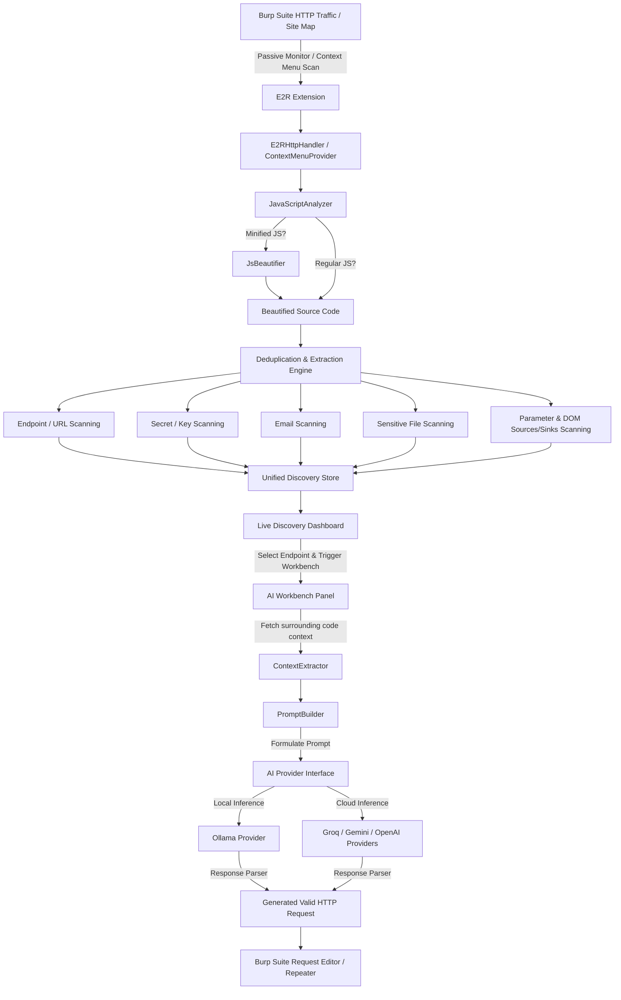
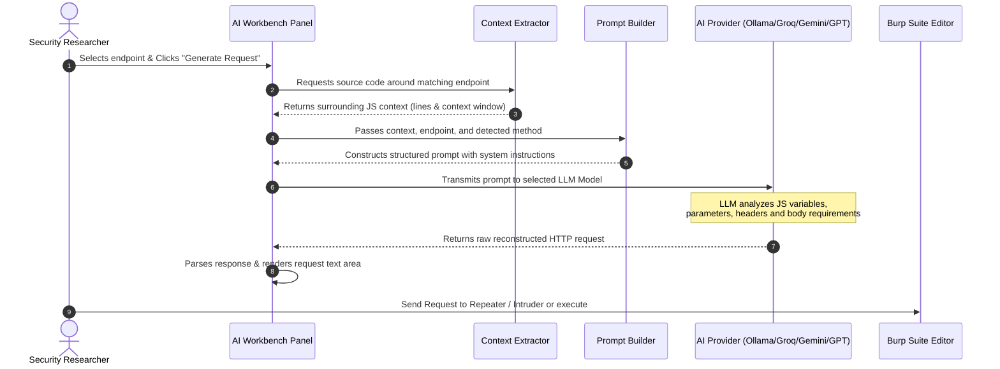

# 🎯 E2R - Endpoint To Request (AI-Powered JS Reconnaissance)

<p align="center">
  
  
  
  
</p>

---

## 🌟 Introduction

**E2R (Endpoint To Request)** is a state-of-the-art **Burp Suite extension** designed to revolutionize client-side JavaScript reconnaissance. Built on the modern **Montoya API**, E2R goes far beyond legacy scanners. It passively monitors, extracts, and categorizes endpoints, URLs, high-entropy secrets, developer emails, parameters, and DOM-based sources/sinks. 

The crown jewel of E2R is its **AI Workbench**. Using local or cloud-based LLMs, E2R parses the surrounding JavaScript code context of a discovered endpoint and **reconstructs a fully valid, raw HTTP request** (complete with realistic parameters, headers, and request bodies) ready to be tested in Burp Repeater or Intruder.

---

## 🔍 How E2R Works (Under the Hood)

E2R functions as an intelligent interceptor and scanner that operates seamlessly during your normal browsing workflow or as an active scanner on-demand.

### The Execution Pipeline:

1. **Traffic Interception & Scope Validation**: The extension intercepts incoming HTTP responses. If a resource is within Burp's **Target Scope**, it proceeds.
2. **MIME & Resource Filtration**: E2R validates if the response is a script (e.g., `.js` file, inside HTML `<script>` tags, JSON responses, or MIME-type scripts). It automatically filters out blacklisted extensions (images, CSS, fonts) and directories (like `/_next/`).
3. **On-the-Fly Beautification**: Minified JavaScript files are difficult for regex matchers and LLMs to read. E2R's internal **Beautifier** expands and formats minified code in-memory. This ensures accurate line number tracking and highly readable code contexts for the LLM.
4. **Pattern & Entropy Extraction**: Multi-threaded scanner engines parse the beautified code using tuned, false-positive-resistant regex patterns to identify:
   * **Endpoints**: API routes and relative paths.
   * **URLs**: Absolute external paths.
   * **Secrets**: High-entropy strings (AWS keys, Stripe credentials, slack webhooks, private keys, API keys).
   * **Emails**: Support or developer emails (filtering out dummy or system emails).
   * **Sensitive Files**: References to configuration, backups, environment, or database files (`.env`, `.conf`, `.sql`, etc.).
   * **Parameters**: Query, JSON, and post parameters found in the JS structure.
   * **DOM Sources & Sinks**: DOM properties vulnerable to Client-Side XSS (e.g., `location.hash`, `innerHTML`, `eval`).
5. **Deduplication and Storage**: Findings are passed to a synchronized, thread-safe **Discovery Store** that deduplicates findings on a unique compound key.
6. **AI Prompt Reconstruction**: When a user selects an endpoint in the **AI Workbench**, the extension isolates the surrounding lines of JavaScript source code (the Context Window). It formats a tailored developer prompt containing:
   * The targeted endpoint path and host.
   * A method hint (inferred from surrounding keywords like `POST`, `fetch`, `axios.put`, etc.).
   * The actual code snippet containing parameters.
7. **LLM Generation**: The prompt is processed via your selected provider. The LLM acts as an expert parser, returning a **RAW HTTP request** with realistic payload values.
8. **Security Testing**: The generated request is loaded directly into Burp Suite, letting you send it straight to **Repeater**, **Intruder**, or execution.

---

## 📊 Flowcharts & Architecture

### System Architecture Flowchart



### AI Request Generation Sequence Diagram



---

## ✨ Features

### 1. Unified Live Discovery Dashboard
A clean, tabbed panel that organizes passive scanning findings into categorized tables:
* **Endpoints**: API routes extracted from Javascript code.
* **URLs**: External URLs that might reveal third-party services or API backends.
* **Secrets**: API keys, AWS credentials, auth tokens, Slack webhooks, and private keys.
* **Emails**: Developer, administrator, or support email addresses.
* **Files**: References to sensitive file extensions (e.g. `.sql`, `.conf`, `.env`, `.bak`).
* **Parameters**: Query and body parameters mapped from client-side routers or Ajax calls.
* **Sources & Sinks**: Real-time DOM XSS analysis highlighting dangerous inputs (Sources) and outputs (Sinks).

### 2. Live Context Viewer
Select any discovered item to immediately view the file URL, host, exact matching line, and the **surrounding code block** in a syntax-highlighted console. Know exactly how the endpoint or secret is utilized.

### 3. Fully Configurable Filters (Settings Panel)
Fine-tune E2R's detection criteria directly from the **Settings** tab:
* **Extension Blacklist**: Prevent static media or styling files (like `.png`, `.css`, `.woff2`) from cluttering your results.
* **Path Blacklist**: Discard noise from specific paths (e.g., `/_next/`, `/static/js/`, `/node_modules/`).
* *Both lists come pre-configured with industry-standard defaults and can be reset at any time.*

### 4. Advanced AI Workbench
E2R supports **four major AI providers** with multiple model presets, including custom model inputs and real-time connectivity testers:
1. **Ollama (Local/Offline)**: 100% private, no data leaves your machine. Mapped to speed-optimized coding models like `qwen2.5-coder:7b`.
2. **Groq (Lightning-Fast Cloud)**: Fast, free-tier cloud endpoints using models like `llama-3.3-70b-versatile`.
3. **Google Gemini (Deep Context)**: Perfect for handling extremely large JS context windows using models like `gemini-1.5-flash` or `gemini-2.5-flash`.
4. **OpenAI GPT (Premium Accuracy)**: Industry-standard request formatting accuracy using models like `gpt-4o-mini` or `gpt-4o`.

---

## 🛠️ Build & Installation

### Prerequisites
* **Java Development Kit (JDK)**: Version 17 or higher.
* **Gradle**: Handled automatically via Gradle Wrapper.
* **Burp Suite Professional or Community**: Edition `2024.12` or newer (essential for Montoya API compatibility).

### Build from Source
Compile and package the extension with a single command:

```bash
# Clone the repository
git clone https://github.com/yourusername/endpoint2Request.git
cd endpoint2Request/E2R

# Grant execution permissions to Gradle wrapper (Linux/macOS)
chmod +x gradlew

# Build the JAR file
./gradlew build
```

The compiled extension will be output directly to the release directory:
* 📂 `release/E2R-1.2.0.jar`

### Loading into Burp Suite
1. Launch **Burp Suite**.
2. Navigate to the **Extensions** tab -> **Installed** sub-tab.
3. Click the **Add** button.
4. Set **Extension type** to `Java`.
5. Click **Select file** and browse to `release/E2R-1.2.0.jar`.
6. Click **Next**. The extension is now successfully installed, and a new tab named **E2R - Endpoint To Request** will appear in the main suite bar!

---

## ⚙️ AI Configuration

Set up your preferred AI provider in the **Settings** tab:

### 1. Local Processing (Ollama)
* **Setup**: Install [Ollama](https://ollama.com) on your computer.
* **Pull Model**: Run `ollama pull qwen2.5-coder:7b` (recommended) or `ollama pull deepseek-coder`.
* **Configuration**: Select **Ollama (Local)** in the provider dropdown. Ensure the URL is `http://localhost:11434`.
* **Testing**: Click **Test Connection** to verify that Ollama is running and the model is loaded.

### 2. Groq Cloud (Free)
* **Setup**: Log in to [Groq Console](https://console.groq.com) and generate a free API Key.
* **Configuration**: Select **Groq (Cloud)**, paste your API Key in the field, and choose a model (e.g., `llama-3.3-70b-versatile`).
* **Saving**: Save settings, then click **Test Connection**.

### 3. Google Gemini
* **Setup**: Obtain an API Key from the Google AI Studio.
* **Configuration**: Select **Gemini (Cloud)**, input your API key, and choose `gemini-1.5-flash`.

### 4. OpenAI GPT
* **Setup**: Obtain an API Key from your OpenAI Platform account.
* **Configuration**: Select **OpenAI (GPT)**, input your API key, and choose `gpt-4o-mini` (highly cost-effective and accurate).

---

## 🚀 Step-by-Step Security Research Workflow

Maximize your reconnaissance efficiency using this recommended workflow:

### Step 1: Passive Observation
1. Add your target domain to Burp's **Target Scope** (e.g., `https://example.com`).
2. Turn on your browser proxy and navigate through the target application.
3. As you click around, E2R automatically intercept and scans any incoming `.js` file or embedded script in real-time.
4. Go to **E2R** -> **Live Discovery** to watch findings populate.

### Step 2: Target Scope Re-Scanning
1. If you've just loaded E2R or want to scan your entire site map at once, go to Burp's **Target** -> **Site Map**.
2. Right-click on the target domain folder.
3. Select **Extensions** -> **E2R: Scan for Endpoints, Secrets & Files**.
4. E2R will actively query and re-scan every cached JavaScript file in the selected directory.

### Step 3: AI Request Generation
1. Go to the **E2R** tab -> **AI Workbench**.
2. From the list of discovered endpoints, select a target path (e.g. `/api/v1/user/update`).
3. Click the **Generate Request** button.
4. The AI parses the surrounding JavaScript parameters and returns a beautifully structured, raw HTTP request in the text box.

### Step 4: Vulnerability Scanning & Testing
1. Review the generated request in the editor. You can modify parameters, headers, or body fields directly inside E2R.
2. Right-click inside the request editor box.
3. Send the request directly to **Repeater** to execute, or **Intruder** to fuzz!

---

## 🙏 Credits & Inspiration

E2R is built on the shoulders of giants. Special credits go to the authors of:
* **[JSAnalyzer](https://github.com/jenish-sojitra/JSAnalyzer)**: For the baseline regex-based JS parsing structures.
* **LinkFinder**: For pioneer research in JavaScript endpoint discovery.
* **Burp Suite Montoya API**: For providing the ultimate developer experience for Burp extension developers.

---

## 📄 License
This project is licensed under the **MIT License**. Feel free to use, modify, and distribute it in your own commercial or open-source security operations.
