<div dir="rtl">

# 🎯 افزونه E2R - Endpoint To Request (شناسایی فایل‌های JS مبتنی بر هوش مصنوعی)

<p align="center">
  
  
  
  
</p>

<p align="left">
  <a href="README.md">🇺🇸 English Version</a>
</p>

---

## 🌟 معرفی

**E2R (Endpoint To Request)** یک **Burp Suite extension** پیشرفته و مدرن است که برای متحول کردن فرآیند reconnaissance کدهای JavaScript سمت کلاینت طراحی شده است. E2R با بهره‌گیری از نسخه جدید **Montoya API**، فراتر از اسکنرهای قدیمی عمل کرده و به صورت غیرفعال (Passive) ترافیک را مانیتور کرده و اقدام به استخراج و دسته‌بندی endpointها، آدرس‌های URL، مقادیر حساس با آنتروپی بالا (Secrets)، ایمیل‌های توسعه‌دهندگان، parameterها و منابع/سینک‌های DOM-based (DOM-based sources/sinks) می‌کند.

ویژگی منحصربه‌فرد E2R پنل **AI Workbench** آن است. با استفاده از مدل‌های زبانی محلی (local LLMs) یا ابری (cloud LLMs)، این افزونه **JavaScript code context** اطراف یک endpoint کشف‌شده را تحلیل کرده و **یک raw HTTP request معتبر** (همراه با هدرها، پارامترها و بدنه فرضی متناسب با سناریو) بازسازی می‌کند که مستقیماً در **Burp Repeater** یا **Intruder** قابل تست و بهره‌برداری است.

> [!IMPORTANT]
> **شرط الزامی تنظیم Target Scope**:
> برای اینکه E2R بتواند ترافیک ورودی را تحلیل کند یا اسکن‌های فعال (Active Scan) انجام دهد، دامنه هدف **باید حتماً در بخش Target Scope در Burp Suite اضافه شده باشد** (`Target` -> `Scope`). E2R برای حفظ حداکثری performance و جلوگیری از انباشت داده‌های نامربوط، تمامی ترافیک‌ها و فایل‌های خارج از scope فعال را به طور کامل نادیده می‌گیرد.

---

## 🔍 نحوه کارکرد فنی (Under the Hood)

افزونه E2R به صورت یک شنودکننده هوشمند و اسکنر هم‌زمان در جریان وب‌گردی روزمره شما یا به صورت اسکن درخواستی (بر اساس منوی راست‌کلیک) کار می‌کند.

### خط لوله اجرا (Execution Pipeline):

1. **شنود ترافیک و Scope Validation**: افزونه پاسخ‌های HTTP دریافتی را فیلتر می‌کند؛ در صورتی که منبع در محدوده **Target Scope** برپ‌سویت باشد پردازش آغاز می‌شود، در غیر این صورت فورا نادیده گرفته می‌شود.
2. **فیلتر MIME & Resource**: بررسی می‌شود که آیا پاسخ حاوی کدهای جاوااسکریپت (مانند فایل‌های `.js`، تگ‌های `<script>` درون HTML، پاسخ‌های JSON یا سایر انواع ترافیک اسکریپتی) است یا خیر. فرمت‌های استاتیک بلک‌لیست (مانند تصاویر، فونت‌ها و CSS) و مسیرهای نویزدار (مانند `/_next/`) نادیده گرفته می‌شوند.
3. **زیباسازی خودکار کدها (Beautify)**: کدهای فشرده‌شده و minified برای موتورهای Regex و همچنین مدل‌های زبانی ناخوانا هستند. E2R به صورت خودکار و در لحظه کدهای فشرده را درون حافظه به کدهای خوانا بازسازی (Beautify) می‌کند. این کار به شماره‌گذاری صحیح خطوط کدهای آسیب‌پذیر و ایجاد بهترین context برای هوش مصنوعی کمک شایانی می‌کند.
4. **استخراج الگوها (Pattern Extraction)**: موتور چندنخی اسکن با استفاده از پترن‌های کاملاً بهینه‌سازی شده و ضد false positive، موارد زیر را استخراج می‌کند:
   * **Endpoints**: مسیرهای API و آدرس‌های نسبی.
   * **URLs**: آدرس‌های مطلق به دامنه‌ها یا سرویس‌های خارجی.
   * **Secrets**: رشته‌های حساس با آنتروپی بالا (کلیدهای AWS، Stripe، وب‌هوک‌های Slack، کلیدهای خصوصی و غیره).
   * **Emails**: ایمیل‌های شخصی یا پشتیبانی توسعه‌دهندگان.
   * **Sensitive Files**: ارجاع به فایل‌های حساس پیکربندی یا دیتابیس (`.env`، `.conf`، `.sql` و غیره).
   * **Parameters**: پارامترهای فرمت‌های Query یا بدنه اسکریپت‌ها.
   * **DOM Sources & Sinks**: ورودی‌ها و خروجی‌های خطرناک آسیب‌پذیری Client-Side XSS (نظیر `location.hash` یا `innerHTML` یا `eval`).
5. **Deduplication و ذخیره‌سازی**: یافته‌ها پس از عبور از فیلتر تکرارزدایی در یک پایگاه داده همگام و ایمن به نام **Discovery Store** ذخیره می‌شوند.
6. **Prompt Reconstruction و بازسازی کانتکست**: هنگامی که کاربر یک endpoint را در پنل **AI Workbench** انتخاب می‌کند، افزونه چند خط قبل و بعد از آن را به عنوان **Context Window** جدا می‌کند و آن را درون پرامپتی دقیق شامل اطلاعات زیر به هوش مصنوعی می‌فرستد:
   * مسیر endpoint و هاست هدف.
   * حدس متد درخواست (مانند `POST` یا `GET` که از عبارات کلیدی مجاور نظیر `fetch` یا `axios.put` استخراج شده است).
   * بدنه کد شامل کانتکست پارامترها.
7. **LLM Generation**: پرامپت توسط LLM پردازش شده و یک **raw HTTP request** معتبر با مقادیر واقعی پارامترها تولید می‌شود.
8. **Security Testing**: این درخواست درون ادیتور برپ سویت لود شده و آماده ارسال به **Repeater** یا **Intruder** جهت انجام تست‌های نفوذ خواهد بود.

---

## 📊 نمودارهای معماری پروژه

### فلوچارت معماری سیستم (System Architecture Flowchart)

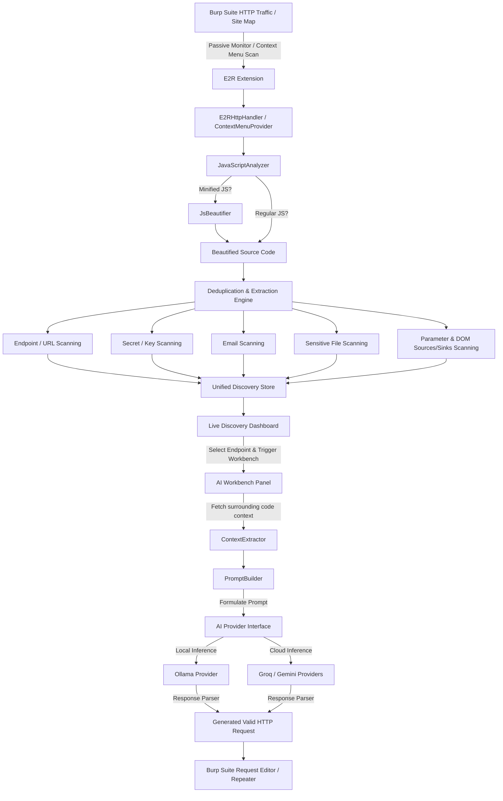

### نمودار توالی بازسازی درخواست هوش مصنوعی (AI Request Generation Sequence Diagram)

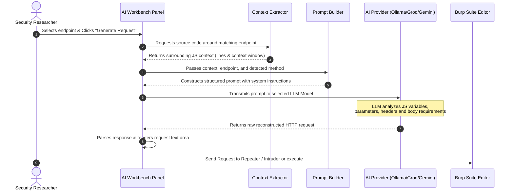

---

## ✨ قابلیت‌ها و ویژگی‌ها

### ۱. داشبورد یکپارچه کشفیات (Unified Live Discovery Dashboard)
یک پنل تمیز و تب‌بندی شده برای دسترسی لحظه‌ای به موارد استخراج شده از فایل‌های اسکریپت:
* **Endpoints**: استخراج تمیز تمام مسیرهای API به همراه تصاویر پیش‌نمایش.
  <br>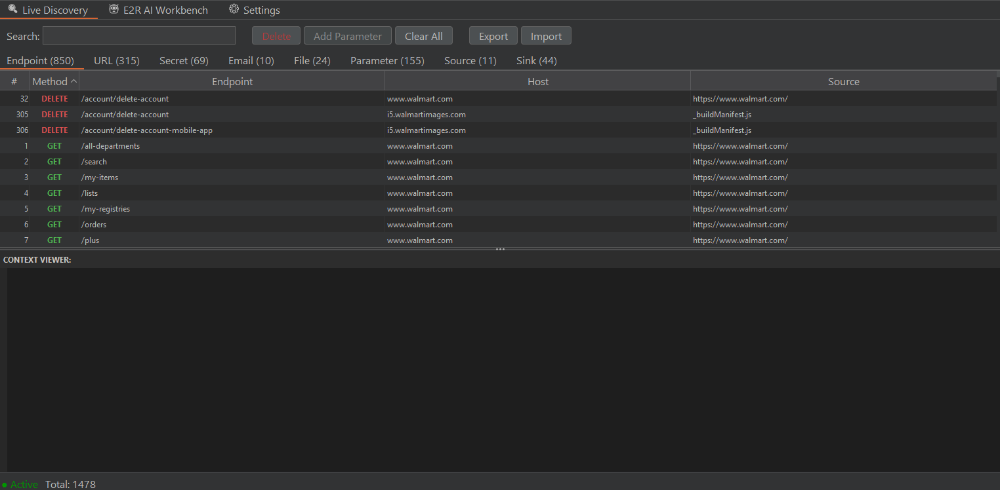<br>
  
* **URLs**: استخراج آدرس‌های absolute خارجی.
  <br>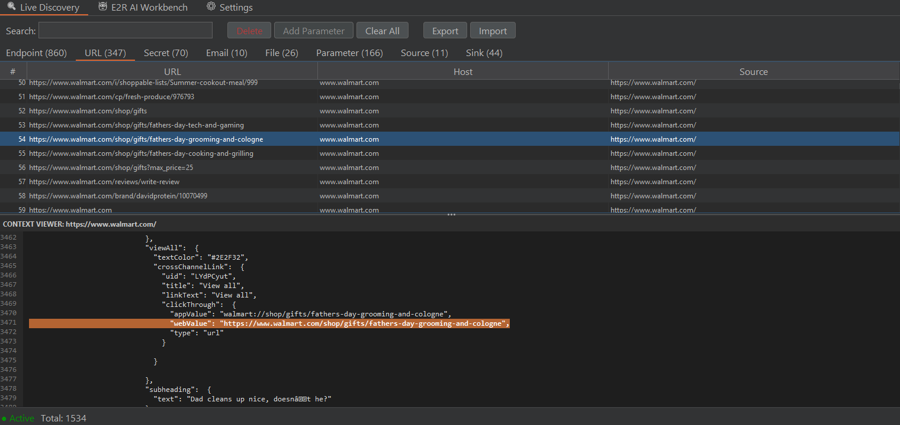<br>
  
* **Secrets**: شناسایی و مانیتور انواع کلیدها و Secrets حساس نظیر کلیدهای سرویس‌های کلاود.
  <br>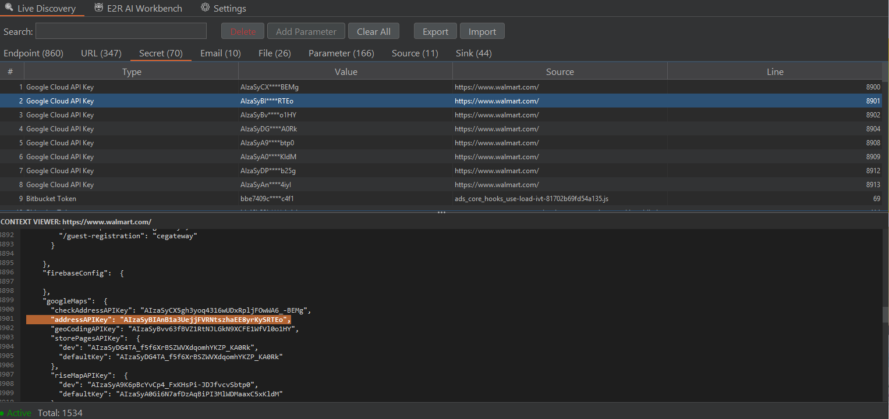<br>
  
* **Emails**: لیست ایمیل‌های مرتبط به طراحان و مدیران سیستم.
  
* **Files**: شناسایی هرگونه ارجاع به فایل‌های حساس پشتیبان یا پایگاه‌داده.
  <br>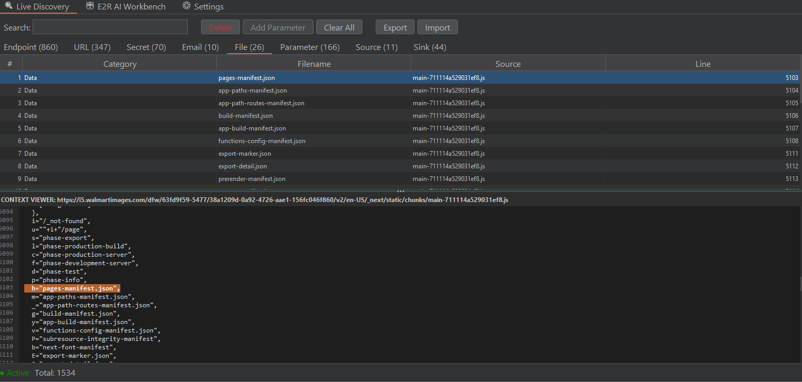<br>
  
* **Parameters**: لیست پارامترهای کشف شده از درخواست‌ها و آبجکت‌های سمت کلاینت.
  <br>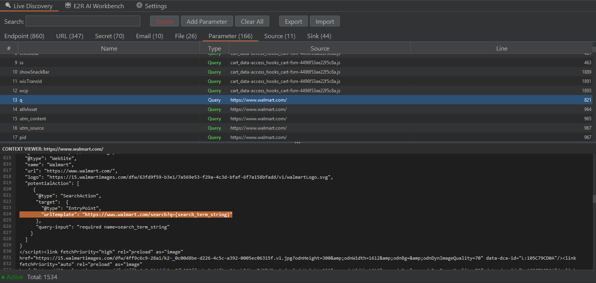<br>
  
* **DOM Sources & Sinks**: بررسی و استخراج ورودی و خروجی‌های خطرناک آسیب‌پذیری DOM XSS جهت یافتن آسیب‌پذیری‌های کلاینت‌ساید.
  <br>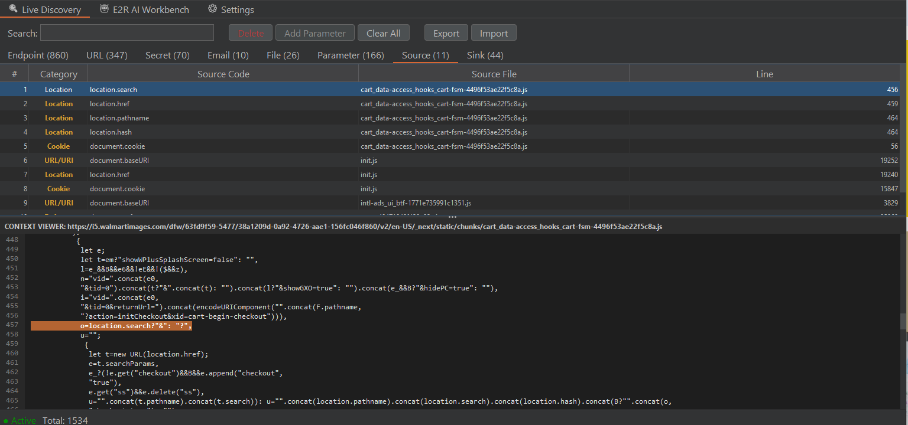<br>
  <br>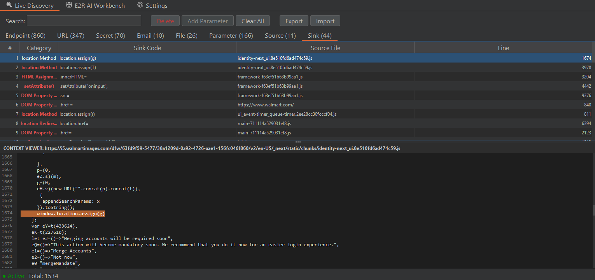<br>

### ۲. نمایشگر زنده کانتکست کد (Live Context Viewer)
با کلیک روی هر آیتم، آدرس کامل اسکریپت، نام هاست، خط دقیق کشف و همچنین چند خط قبل و بعد از آن کد منبع برای شما در قالب یک کنسول تیره و خوانا رندر خواهد شد تا بدانید چگونه endpoint یا secret مورد نظر استفاده شده است.

### ۳. فیلترهای پیشرفته بلک‌لیست (Settings Panel)
از طریق تب تنظیمات می‌توانید رفتارهای اسکنر را کاملاً شخصی‌سازی کنید:
* **Extension Blacklist**: بلک‌لیست پسوندها جهت ممانعت از شلوغ شدن کشفیات با فایل‌های استاتیک بیهوده (نظیر `.png` یا `.css`).
* **Path Blacklist**: نادیده گرفتن تمام مسیرهای پر نویز (نظیر مسیرهای فریم‌ورک‌ها مانند `/_next/` یا `node_modules`).
<br>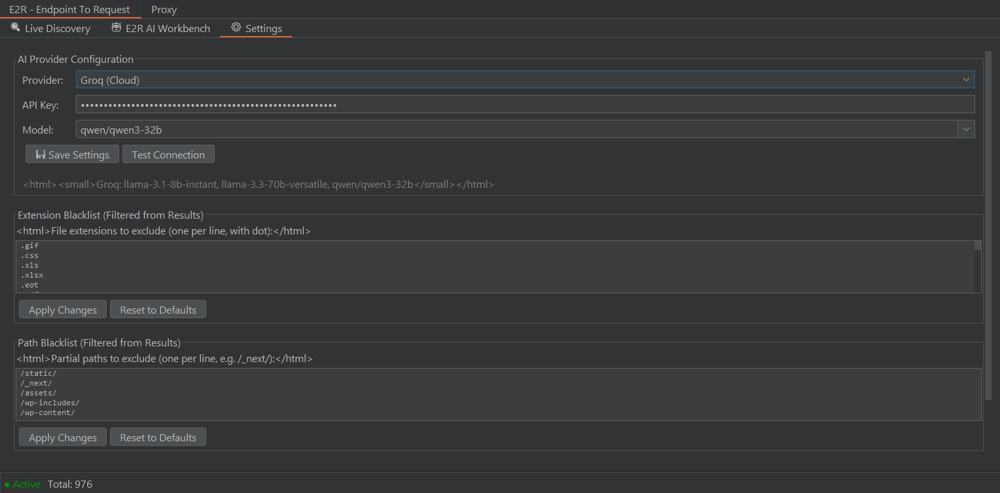<br>
<br>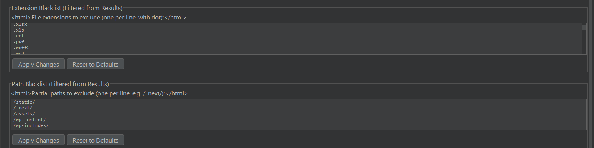<br>

### ۴. پنل Advanced AI Workbench
پشتیبانی از **سه ارائه‌دهنده قدرتمند هوش مصنوعی** به همراه امکان تست اتصال لحظه‌ای و افزودن مدل دلخواه:
1. **Ollama (محلی/۱۰۰٪ آفلاین)**: کاملاً امن و محلی بدون خروج اطلاعات از سیستم شما. بهینه‌سازی شده برای کار با مدل‌هایی مثل `qwen2.5-coder:7b`.
2. **Groq (ابری پر سرعت)**: پردازش فوق‌سریع در بستر ابر با مدل‌هایی مثل `llama-3.3-70b-versatile`.
3. **Google Gemini (کانتکست عمیق)**: ایده‌آل برای ارسال حجم بالایی از فایل‌های کدهای جاوااسکریپت با مدل‌هایی مثل `gemini-1.5-flash` یا `gemini-2.5-flash`.

<br>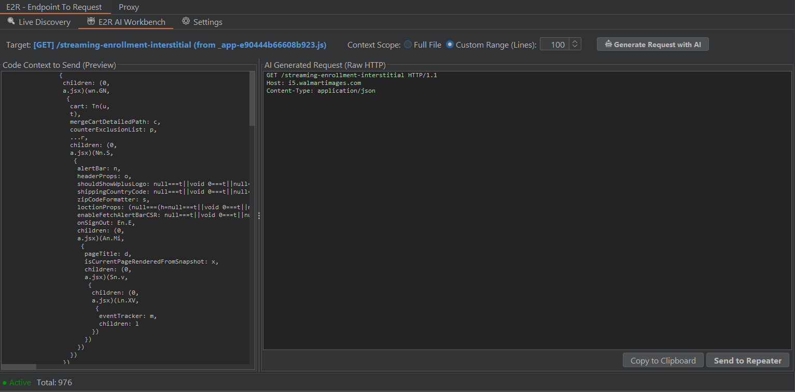<br>

---

## 🛠️ ساخت و نصب افزونه (Build & Installation)

### پیش‌نیازها (Prerequisites)
* **کیت توسعه جاوا (JDK)**: نسخه ۱۷ یا بالاتر.
* **Gradle Wrapper**: که به صورت پیش‌فرض در مخزن قرار دارد و به طور خودکار لود می‌شود.
* **نرم‌افزار Burp Suite**: نسخه `2024.12` یا بالاتر (جهت پشتیبانی کامل از Montoya API).

### کامپایل افزونه از سورس (Build from Source)
با اجرای دستورهای زیر در ترمینال، افزونه را به صورت خودکار کامپایل و بسته‌بندی کنید:

```bash
# کلون کردن مخزن گیت
git clone https://github.com/maverick0o0/E2R.git
cd E2R/E2R

# اعطای دسترسی اجرایی به Gradle wrapper (در سیستم‌عامل‌های لینوکس و مک)
chmod +x gradlew

# کامپایل و بیلد پروژه در قالب فایل JAR
./gradlew build
```

فایل افزونه با موفقیت درون پوشه release ساخته خواهد شد:
* 📂 `release/E2R-1.2.0.jar`

### بارگذاری در Burp Suite
1. نرم‌افزار **Burp Suite** را اجرا کنید.
2. به تب **Extensions** و زبانه **Installed** بروید.
3. روی دکمه **Add** کلیک کنید.
4. در پنجره باز شده، بخش **Extension type** را روی **Java** بگذارید.
5. دکمه **Select file** را انتخاب کرده و مسیر فایل `release/E2R-1.2.0.jar` را به آن بدهید.
6. روی دکمه **Next** کلیک کنید. افزونه با موفقیت لود شده و تب جدیدی به نام **E2R - Endpoint To Request** در منوی اصلی ظاهر خواهد شد!

---

## ⚙️ تنظیمات هوش مصنوعی (AI Configuration)

سرویس مورد نظر خود را در زبانه **Settings** کانفیگ کنید:

### ۱. اجرای محلی (Ollama)
* **راه‌اندازی**: نرم‌افزار [Ollama](https://ollama.com) را روی کامپیوتر خود نصب کنید.
* **دانلود مدل (Pull)**: در ترمینال سیستم خود دستور `ollama pull qwen2.5-coder:7b` (پیشنهادی) را اجرا کنید.
* **تنظیمات**: بخش Provider را روی **Ollama (Local)** بگذارید و فیلد آدرس را روی `http://localhost:11434` تنظیم کنید.
* **تست**: روی دکمه **Test Connection** کلیک کنید تا از اتصال صحیح مطمئن شوید.

### ۲. سرویس کلاود Groq Cloud
* **راه‌اندازی**: به پنل توسعه‌دهندگان [Groq Console](https://console.groq.com) رفته و یک کلید API رایگان بسازید.
* **تنظیمات**: سرویس را روی **Groq (Cloud)** بگذارید، کلید خود را پیست کرده و مدل پیشنهادی `llama-3.3-70b-versatile` را انتخاب کنید.

### ۳. سرویس کلاود گوگل (Google Gemini)
* **راه‌اندازی**: به پرتال Google AI Studio مراجعه کرده و یک کلید API رایگان بسازید.
* **تنظیمات**: سرویس را روی **Gemini (Cloud)** بگذارید، کلید API را وارد کرده و مدل `gemini-1.5-flash` را انتخاب کنید.

---

## ⚠️ رفع خطای ۴۰۴ در Ollama (Troubleshooting Ollama 404 Error)

اگر در زبانه تنظیمات بر روی **Test Connection** کلیک می‌کنید و اتصال با پیام `✓ Connected to Ollama (Local)` تایید می‌شود، اما به هنگام تولید درخواست در Workbench با خطای زیر مواجه می‌شوید:
```text
Error generating request:

Ollama error: 404 Not Found
```
لطفاً برای حل این مسئله سه مورد زیر را بررسی کنید:

1. **بررسی دانلود مدل**: سرور Ollama در صورتی که نتواند مدل انتخابی شما را در مخزن لوکال خود پیدا کند، خطای ۴۰۴ می‌دهد.
2. **بررسی املای نام مدل**: ترمینال خود را باز کرده و دستور `ollama list` را بنویسید. املای دقیق نام مدل را در زبانه Settings افزونه منطبق با خروجی این دستور (به همراه تگ‌ها مثل `:7b`) بنویسید (مثلاً `qwen2.5-coder:7b` به جای `qwen2.5-coder`).
3. **دانلود مدل**: در صورتی که مدل دانلود نشده است، دستور دانلود آن را در ترمینال بنویسید:
   ```bash
   ollama pull qwen2.5-coder:7b
   ```

---

## 🚀 راهنمای گام‌به‌گام گردش کار امنیتی (Step-by-Step Security Research Workflow)

با استفاده از گردش کار زیر، بیشترین بهره را از اسکن فایل‌های جاوااسکریپت ببرید:

### گام اول: وب‌گردی و شناسایی غیرفعال (Passive Observation)
1. **تنظیم اسکوپ**: دامنه اصلی هدف را حتماً به **Target Scope** برپ‌سویت اضافه کنید.
2. **وب‌گردی**: مرورگر پروکسی‌شده خود را باز کرده و در بخش‌های مختلف برنامه تحت تست بچرخید.
3. **اسکن خودکار**: E2R به صورت بلادرنگ کدهای جاوااسکریپتی که در ترافیک لود می‌شوند را زیباسازی و اسکن می‌کند.
4. **مشاهده نتایج**: نتایج را در تب **E2R** -> **Live Discovery** ببینید.

### گام دوم: اسکن دستی مجدد نقشه سایت (Target Scope Re-Scanning)
1. در نرم‌افزار Burp Suite به بخش **Target** -> **Site Map** بروید.
2. روی فولدر دامنه مورد نظر (که باید حتماً در Scope باشد) راست‌کلیک کنید.
3. گزینه **Extensions** -> **E2R: Scan for Endpoints, Secrets & Files** را انتخاب کنید تا تمام فایل‌های اسکریپت کش‌شده آن مسیر مجدداً اسکن شوند.

### گام سوم: تولید درخواست با هوش مصنوعی (AI Request Generation)
1. به تب **E2R** -> **AI Workbench** بروید.
2. از میان مسیرهای استخراج شده، یکی را انتخاب کنید (مثلاً `/api/v1/user/update`).
3. بر روی دکمه **Generate Request** کلیک کنید. هوش مصنوعی کدهای اطراف endpoint را تحلیل کرده و درخواست خام را برایتان رندر می‌کند.

### گام چهارم: تست‌های امنیتی پیشرفته (Vulnerability Scanning & Testing)
1. درخواست بازسازی‌شده را ویرایش یا تکمیل کنید و هدرهای مورد نظر را بیفزایید.
2. راست‌کلیک کرده و درخواست را مستقیماً به بخش **Repeater** (برای تست دستی) یا **Intruder** (برای فازینگ و بروت‌فورس پارامترها) بفرستید!

---

## 🙏 تشکر و اعتبارات (Credits & Inspiration)

این افزونه با الهام از پروژه‌های ارزشمند زیر ساخته شده است:
* **[JSAnalyzer](https://github.com/jenish-sojitra/JSAnalyzer)**: به خاطر ساختارهای پایه و پترن‌های اولیه استخراج عبارات در جاوااسکریپت.
* **LinkFinder**: پدربزرگ تمام ابزارهای شناسایی اندپوینت در JS.
* **تیم Montoya API**: به خاطر ارائه محیط توسعه بسیار غنی برای توسعه‌دهندگان برپ.

---

## 📄 لایسنس (License)

این پروژه تحت لایسنس **MIT** منتشر شده است. استفاده، ویرایش و توسعه مجدد آن در پروژه‌های تجاری یا متن‌باز کاملاً آزاد است.

</div>
