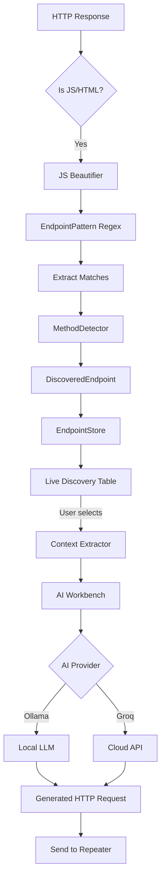

# E2R - Endpoint To Request

<p align="center">
  
  
  
</p>

**E2R** is a Burp Suite extension that passively discovers API endpoints from JavaScript files and uses AI (Ollama or Groq) to generate ready-to-use HTTP requests.

---

## 🚀 Features

| Feature | Description |
|---------|-------------|
| **Passive Scanning** | Automatically extracts endpoints from JS files during browsing |
| **AI Request Generation** | Uses Ollama (local) or Groq (cloud) to generate HTTP requests |
| **Smart Method Detection** | Infers HTTP methods (GET/POST/PUT/DELETE) from code context |
| **JS Beautifier** | Automatically formats minified JavaScript for better analysis |
| **Configurable Filters** | Blacklist file extensions and paths to reduce noise |
| **Import/Export** | Save and load discovered endpoints as JSON |

---

## 📐 Architecture

```
┌─────────────────────────────────────────────────────────────────┐
│                        Burp Suite                                │
│  ┌─────────────────────────────────────────────────────────────┐ │
│  │                    E2R Extension                             │ │
│  │                                                              │ │
│  │  ┌──────────────┐    ┌──────────────┐    ┌──────────────┐   │ │
│  │  │ HTTP Handler │───▶│  JS Analyzer │───▶│EndpointStore │   │ │
│  │  │  (Passive)   │    │ + Beautifier │    │ (Thread-safe)│   │ │
│  │  └──────────────┘    └──────────────┘    └──────────────┘   │ │
│  │         │                   │                   │            │ │
│  │         ▼                   ▼                   ▼            │ │
│  │  ┌──────────────┐    ┌──────────────┐    ┌──────────────┐   │ │
│  │  │EndpointPattern│   │MethodDetector│    │   UI Tabs    │   │ │
│  │  │   (Regex)    │    │  (Heuristics)│    │ (Discovery,  │   │ │
│  │  └──────────────┘    └──────────────┘    │  AI, Settings)│  │ │
│  │                                          └──────────────┘   │ │
│  │                              │                               │ │
│  │                              ▼                               │ │
│  │                      ┌──────────────┐                        │ │
│  │                      │  AiProvider  │                        │ │
│  │                      │ (Ollama/Groq)│                        │ │
│  │                      └──────────────┘                        │ │
│  └─────────────────────────────────────────────────────────────┘ │
└─────────────────────────────────────────────────────────────────┘
```

---

## 🔄 Data Flow



---

## 🧠 Core Logic

### 1. Endpoint Extraction (`EndpointPattern.java`)
Uses a synthesized regex from LinkFinder + GAP to match:
- Full URLs: `https://api.example.com/v1/users`
- Relative paths: `/api/users`, `../config`
- REST endpoints: `users/123/profile`

### 2. Method Detection (`MethodDetector.java`)
Analyzes surrounding code context to infer HTTP methods:
```javascript
// Detects POST from:
fetch('/api/users', { method: 'POST' })
$.post('/api/submit', data)
axios.post('/messages')
```

### 3. AI Request Generation (`PromptBuilder.java`)
Builds a structured prompt with:
- Target endpoint and host
- Code context (±100 lines)
- Method hint from detection
- Instructions to generate Burp-ready HTTP request

---

## 📦 Installation

### Build from Source
```bash
cd E2R
gradle jar
```

### Load in Burp
1. **Extensions → Add**
2. Type: **Java**
3. Select: `release/E2R-1.0.0.jar`

---

## ⚙️ Configuration

### AI Provider Setup

| Provider | Setup |
|----------|-------|
| **Ollama** | Install from [ollama.ai](https://ollama.ai), run `ollama pull qwen2.5-coder:7b` |
| **Groq** | Get API key from [console.groq.com](https://console.groq.com) |

### Recommended Models

| Provider | Model | Best For |
|----------|-------|----------|
| Ollama | `qwen2.5-coder:7b` | Code understanding |
| Groq | `qwen/qwen3-32b` | Fast, high quality |
| Groq | `llama-3.3-70b-versatile` | Complex requests |

---

## 🎯 Usage

1. **Browse target** - E2R passively scans JS files
2. **Review endpoints** - Check Live Discovery tab
3. **Select endpoint** - Click row to see code context
4. **Generate request** - Double-click or use AI Workbench
5. **Send to Repeater** - Test the generated request

---

## 📁 Project Structure

```
E2R/
├── src/main/java/e2r/
│   ├── E2RExtension.java          # Main entry point
│   ├── core/
│   │   ├── EndpointPattern.java   # Regex extraction
│   │   ├── MethodDetector.java    # HTTP method inference
│   │   ├── DiscoveredEndpoint.java# Data model
│   │   ├── EndpointStore.java     # Thread-safe storage
│   │   ├── ContextExtractor.java  # Code context extraction
│   │   └── JsBeautifier.java      # Minified JS formatting
│   ├── scanner/
│   │   ├── E2RHttpHandler.java    # Passive scanner
│   │   ├── JavaScriptAnalyzer.java# JS analysis pipeline
│   │   └── E2RContextMenuProvider.java # Site Map integration
│   ├── ai/
│   │   ├── AiProvider.java        # Strategy interface
│   │   ├── OllamaProvider.java    # Local LLM client
│   │   ├── GroqProvider.java      # Cloud API client
│   │   ├── OllamaClient.java      # HTTP client for Ollama
│   │   └── PromptBuilder.java     # AI prompt construction
│   └── ui/
│       ├── E2RTab.java            # Main tabbed pane
│       ├── LiveDiscoveryPanel.java# Results table + context
│       ├── AIWorkbenchPanel.java  # AI generation interface
│       ├── SettingsPanel.java     # Configuration UI
│       ├── EndpointTableModel.java# Table data model
│       └── ContextViewer.java     # Code display component
└── build.gradle                   # Gradle build config
```

---

## 🔒 Privacy

- **Ollama**: All processing is local, no data leaves your machine
- **Groq**: Only endpoint + context sent to API (no credentials)
- **Settings**: API keys stored in Burp Preferences (encrypted)

---

## 📄 License

MIT License - Use freely for security research and testing.

---

## 🙏 Credits

Inspired by:
- [LinkFinder](https://github.com/GerbenJavado/LinkFinder)
- [GAP](https://github.com/xnl-h4ck3r/GAP-Burp-Extension)
- [jsluice](https://github.com/BishopFox/jsluice)
